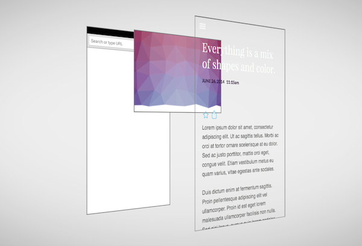

# 昂贵的像素计算

## 导读

你需要知道网页的像素是如何绘制的。不仅仅是出于对知识的积累，同时也是一个现代前端开发人员的基本素养，同时你需要知道如何去优化它们。

## 我们需要知道页面如何渲染

作为一个前端开发人员，有 4 个方面需要我们特别注意：
(如果你想了解页面是如何渲染出来的你可以查看这篇文章——[网页是如何渲染的]())

### Style(样式)的重新计算

在第一个中，我们将了解我们书写的`CSS`选择器如何去匹配对应的元素，并如何为其应用样式。

通常情况下，这个过程是非常快的，除非你的视图中有成千上万的元素并且你频繁的改变其大部分(越靠近根节点变动越大)结构。(比如你在`body`元素添加了一个`class`，这个`class`影响了其所有的子元素的样式)

大多数情况下，**通过优化选择器匹配带来的性能优化收益较小**。

### Layout(布局)

一旦我们知道什么样式(`Styles`)应用于哪个元素(`DOM`)此时我们就得到了一颗渲染 🌲(`Render Tree`)，也就是待会浏览器要在视图上进行绘制的。

在布局中我们可以计算出页面的几何结构，比如元素具体在哪一个位置。这样一来浏览器就会进行较为昂贵的一些计算了，因为元素的具体排列方式是未知的，并且一个元素会受到另一个元素的影响。例如我们该变了`body`元素的大小，那么其内部的元素也会同样的进行改变。

在这个过程中，我们想避免布局混乱(`layout thrashing`)或强制同步布局(`forced synchronous layouts`)，因为其会导致浏览器不必要的重排(`reflow`)。

### Paint(绘制)

当浏览器知道元素在哪里后，它该为其绘制像素点，这个过程会占用大多数时间。

会触发(`Paint`)绘制的属性大多数都是我们肉眼可见的，比如`color/backgroundColor/shadows`。同时，如果你**改变了布局(`layout`)，也会引起绘制(重绘)**，因为如果页面元素的几何位置发生改变，一些像素会受影响，所以需要重新来进行绘制。

### Composite(合成)

默认情况下，我们会将元素绘制到内存的单一层级中，我们可以将其想象为一个画布。如果你用笔刷改变了一个像素，那么你无法将其还原为之前的像素（因为其为破坏性的）。（假设这里没有撤销的操作）

为了解决这个问题，对于画布来说，他们将不同的像素集合圈分到不同的层级，即复合层(复数的层级)。这样一个层级中的变化就不会影响到另一个层级。

当我们完成这些图层时，浏览器将其压成一片，这也就是合成（`Composite`）。

## 避免性能瓶颈

为了开发高性能的动画，我们应该仅去改变那些仅会触发图层合成而不会造成重新布局（`Layout`）或绘制（`Paint`）的属性。（按我们通常说的就是不会导致重排和重绘的）

不仅仅是上述列举的`transform`（`opacity`），理论上所以的`transform`属性都适用。但是你需要将所有的元素都设置在这个图层上。目前最新与最`cooool`的方式是为元素添加`will-change`属性，浏览器会对该属性的某些属性比如`transform/opacity`进行一些底层的优化。（目前来说，`Chrome`浏览器会对使用这两个字段的属性进行单独图层的生成）

Learn and sum up from [Pixels are expensive](https://aerotwist.com/blog/pixels-are-expensive/)
