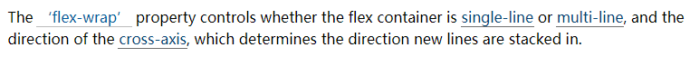
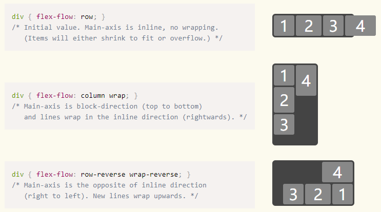
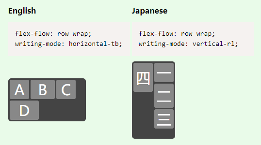
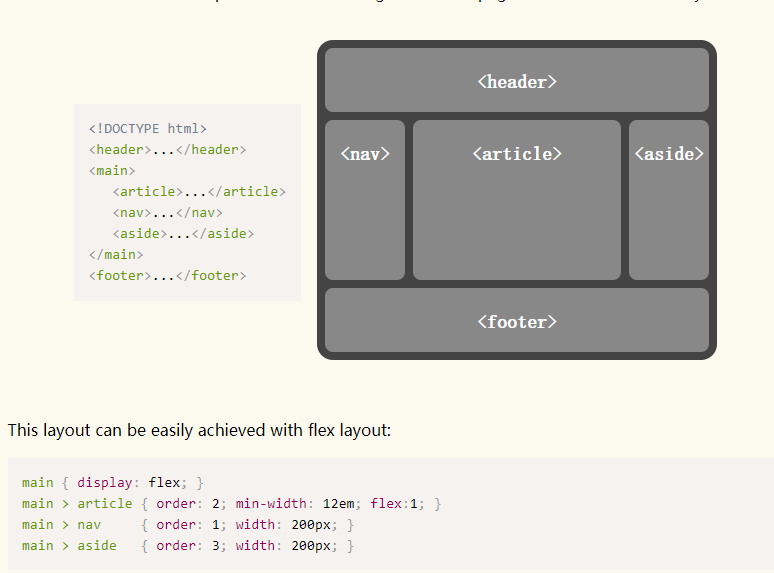

# flex布局

一种可伸缩的弹性布局，具体以以下两条轴线展开(可改变主轴方向)


## 父容器属性

### display:flex

设置容器为`flex`布局

### flex-derection

该属性决定了主轴方向(交叉轴由主轴方向决定)，有以下值：

+ `row`：向右(默认值)
+ `row-reverse`：向左
+ `column`：向下
+ `column-reverse`：向上

交叉轴是由主轴顺时针旋转`90°`得到。

### flex-wrap

**规定了交叉轴的方向**，同时决定子容器是否和如何换行排列，可以逆序排列(交叉轴总是垂直于主轴，默认方向为主轴顺时针旋转`90°`)



1. `nowrap`：不换行
2. `wrap`：换行
3. `wrap-reverse`：逆序换行

<pre>
(1)| 1 2 3 4 5 6|  (2)| 1 2 3 |  (3)| 4 5 6 |
                      | 4 5 6 |     | 1 2 3 |
</pre>

### flex-flow——上两个属性的简写形式

指定子容器沿着什么方向流动、到边缘时是否允许换行，实则为`flex-direction`|`flex-wrap`的复合属性。

值为两个属性的值，可以单独指定也可以同时指定。



`flex-flow`属性是读写模式([`writing-mode`](https://www.w3.org/TR/css-writing-modes-4/#writing-mode))敏感的，所以它可能会出现以下的情况：



### justify-content

定义如何沿**主轴**方向排列子容器，有以下值：

+ 位置排列：
  1. `flex-start`：沿着主轴起点对齐  <pre>|123_______|</pre>
  2. `flex-end`：沿着主轴终点对齐    <pre>|_______123|</pre>
  3. `center`：居中对齐             <pre>|____123____|</pre>

+ 分布排列：

  1. `space-between`：子容器沿主轴均匀分布，位于首尾两端的子容器与父容器紧靠。(间隙均匀分布)
   <pre>|1___2___3|</pre>
  2. `space-around`：子容器沿主轴均匀分布，位于首尾两端的子容器到父容器边缘的距离是子容器间距的一半。
   <pre>|__1_2_3__|</pre>


### align-items

定义子容器在交叉轴的排列，有以下值：

+ 位置排列：
  1. `flex-start`：子容器**顶部**沿着交叉轴起点对齐
  2. `flex-end`：子容器**底部**沿着交叉轴终点对齐
  3. `center`：子容器**中间**在交叉轴方向居中对齐

分别对应编号
<pre>
(1)|  1 2 3  |     (2)|         |   (3)|         |
   |         |        |         |      |  1 2 3  |
   |         |        |  1 2 3  |      |         |
</pre>

+ 基线排列：`baseline` ：基线对齐，这里的`baseline`默认是指首行文字，所有子容器向基线对齐，交叉轴起点到元素基线距离最大的子容器将会与交叉轴起始端相切以确定基线。
+ 拉伸排列：`stretch` ：子容器沿交叉轴方向的尺寸拉伸至与父容器一致。(未指定子容器具体高度的情况下，否则无效)


### align-content

当子容器**多行排列**时，设置行与行之间的交叉轴对齐方式。

+ 位置排列：
  1. `flex-start`：子容器**顶部**沿着交叉轴起点对齐，其他子容器紧挨上面的容器
  2. `flex-end`：子容器**底部**沿着交叉轴终点对齐，其他子容器紧挨下面的容器
  3. `center`：子容器**中间**在交叉轴方向居中对齐
   分别对应编号

<pre>
(1)|  1 2 3  |     (2)|         |   (3)|         |
   |         |        |         |      |  1 2 3  |
   |         |        |  1 2 3  |      |         |
</pre>

+ 分布排列：
  1. `space-between`：交叉轴方向上等间距分布，边界的子容器与父容器相切
  2. `space-around`：交叉轴方向上等间距分布，中间容器间的间距是边界容器与父容器间距的两倍。
+ 拉伸排列：`stretch` ：拉伸容器内每个项目占据空间，填充方式是每个项目下方增加空白(默认值)


## 子容器属性

### flex-basis

设置基准大小，表示在不伸缩的情况下子容器的原始大小。主轴为横向时表示宽度，纵向时表示高度。

当该值设置百分比属性时，该属性以父级容器(flex容器)的`width`为基准；当父级容器未指定`width`时，则值为`content`(即以其中的内容为基础)

### flex-grow

子容器弹性伸展的比例，在剩余空间中按给定的比例分配给子容器

### flex-shrink

设置子容器的收缩比例，默认值为`1`。当子容器宽度(主轴向右)超过父容器时，超出部分按`flex-shrink`的比例，在每个子容器中进行缩减。如父容器`width`为`200px`，有两个子容器且宽度为`120px`，比例为`2：1`，则显示时，子容器宽度分别为`120-40/3*2`与`120-40/3`

### order

设置子容器排列顺序，默认值为`0`，可以为负值，数值越小排列越靠前。利用该属性，我们就可以更简单的完成圣杯布局：



### flex

定义在主轴上如何伸缩。按flex属性的比例来自动填充剩余的空间。
`flex`属性是`flex-grow`|`flex-shrink`|`flex-basis`三个属性的缩写

当`flex`为一个值时，分别对应以下属性：

+ `none`：不使用任何值，等价于`0 0 auto`
+ 单位值：`flex-basis`
+ 无单位：`flex-grow`：将父容器剩余空间按`flex-grow`比例分配

两个值：

+ 第二个值有单位：` flex-grow`|`flex-basis`
+ 第二个值无单位：` flex-grow`|`flex-shrink`

三个值：`flex-grow`|`flex-shrink`|`flex-basis`

**官方推荐使用flex来替代单独的flex-\*属性的书写，因为使用flex属性可以正确的重置一些未指定的属性**

### align-self

单独设置每个子容器如何沿交叉轴排列。该值权重大于父容器`align-items`，同时设置时以该值为准

+ 位置排列：
  1. `flex-start`：该容器**顶部**沿着交叉轴起点对齐
  2. `flex-end`：该容器**底部**沿着交叉轴终点对齐
  3. `center`：该容器**中间**在交叉轴方向居中对齐

+ 基线排列：`baseline` ：基线对齐,该容器向基线对齐，交叉轴起点到元素基线距离最大的子容器将会与交叉轴起始端相切以确定基线。

+ 拉伸排列：`stretch` ：该容器沿交叉轴方向的尺寸拉伸至与父容器一致。(未指定该容器具体高度的情况下，否则无效)

## 其他问题

1. 如果`flex`布局中的子项目为一个绝对定位的元素(即`position`不为`static/relatived`)，那么它不会受`flex`布局的影响。

2. 相邻的`flex`子项目之间的`margin`是不会重叠的。子项目属性包含`margin: auto;`的项目变现和块级元素相似，它会自动分配剩余的空间到子项目的两边，所以我们可以用它来达到垂直居中：

```html
<style>
.father {
    display: flex;
}

.son {
    margin: auto;
}
</style>
<div class="father">
    <div class="son"></div>
</div>
```


